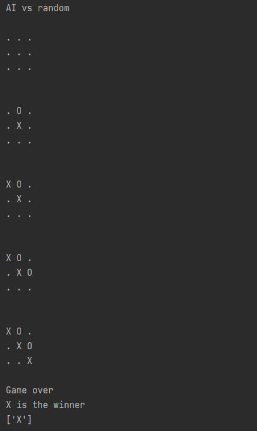

# tictactoeAI
Implementation of Minimax Algorithm on tic tac toe.

## Board


## Minimax Explanation

The Minimax Algorithm will maximize the score for X and minimize the score for O. This way the AI can choose the optimum move for each player.
Our basic algorithm for the maximum player will be:
```
def maximizer(state):
  create an empty dictionary
  if there is empty spots on the board:
    place player
    calculate utility
    if there is a winner:
      append the score and its position to a dictionary
    else:
      use the minimizer and get the minimum
      append that minimum
 return the dictionary
```

## Code Explanation
  ### Dictionary
   The two methods will returrn the max/min value from a dictionary.
   
  ### Maximizer
   The maximizer will maximize the moves for the maximum player, usually X or human.
   
  ### Minimizer
   The minimizer will minimize the moves for the minimun player, usually O or computer.
   
  ### Utility functions
   This function will calculate the values of each position for the current board. 
   We will assign a value for each state of winning: 
   
      wins = 1, draw = 0
      
   The utility function, which is combined in the code, will add the winner value to the numbers of empty positions. If the winner is the minimum player, we will multiply the utility value by -1(reference: https://youtu.be/fT3YWCKvuQE).
   
      utility = (winning state + empty spots) * (winning player)
      
   For example, in the board above, if X wins immediate, the utility equation should return (1 + 7) * 1 = 8
   
## Game File
All the print functions are turned off, or the games should run like this:




The first two moves are randomly generated to make the program run faster.

There is also an interactive function called AI_human, where the player can play against the AI.

## Game Analysis
