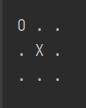
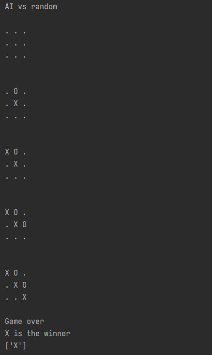

# tictactoeAI
Implementation of Minimax Algorithm on tic tac toe.

## Board


## Minimax Explanation

The Minimax Algorithm will maximize the score for X and minimize the score for O. This way the AI can choose the optimum move for each player.
Our basic algorithm for the maximum player will be:
```
def maximizer(board, player):
  create an empty dictionary
  for every empty spots on the board:
    place player
    calculate the score of current board
    if there is a winner:
      append the score and its position to a dictionary
    else:
      call the minimizer and get the minimum
      append that minimum
 return the dictionary
```

## Code Explanation
  ### Game Setup
   We will create a list of three lists, each containing three strings. From top to bottom, left to right, we number each position from 1 to 9. The positions should be as follow:
   
```
   1  2  3
   
   4  5  6
   
   7  8  9
```   
   There are also three chips: X, O, and EMPTY, which are all type string. When the game starts, a new empty board will be created:
   
```
   .  .  .
   
   .  .  .
   
   .  .  .
```

   The other functions are:
   * Positions
      * Convert the number position into indices
      * Return the player at a position
   * Empty or not
      * Check if the position is empty
      * Count the numbers of empty positions
      * Return all empty positions
   * Moves
      * A method for human players to type their moves
      * Place a chip at a certain position
      * Place a chip at a random position
   * Winners
      * Check if the board still has empty spots
      * Return the winner
      
   With these basic functions, we can build a tic-tac-toe game against a random computer.
      
  ### Dictionary
   The two methods will return the first of all max/min values from a dictionary.
   
  ### Maximizer
   The maximizer will maximize the moves for the maximum player, usually X or human.
   
  ### Minimizer
   The minimizer will minimize the moves for the minimun player, usually O or computer.
   
  ### Utility functions
   This function will calculate the values of each position for the current board. 
   We will assign a value for each state of winning: 
   
      wins = 1, draw = 0
      
   The utility function, which is combined in the code, will add the winner value to the numbers of empty positions. If the winner is the minimum player, we will multiply the utility value by -1. [1]
   
      utility = (winning state + empty spots) * (winning player)
      
   For example, in the board above, if X wins immediate, the utility equation should return (1 + 7) * 1 = 8
   
## Game.py

The first two moves are randomly generated to make the program run faster. For now, the file will return a list of winners for each type of game.


All the print functions are turned off, or the games should run like this:




There is also an interactive function called AI_human, where the player can play against the AI.

## Game Analysis


## Footnotes
[1]: Coding an UNBEATABLE Tic Tac Toe AI (Game Theory Minimax Algorithm EXPLAINED) https://youtu.be/fT3YWCKvuQE
