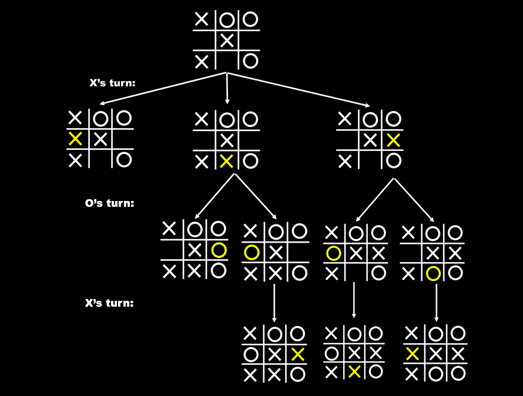
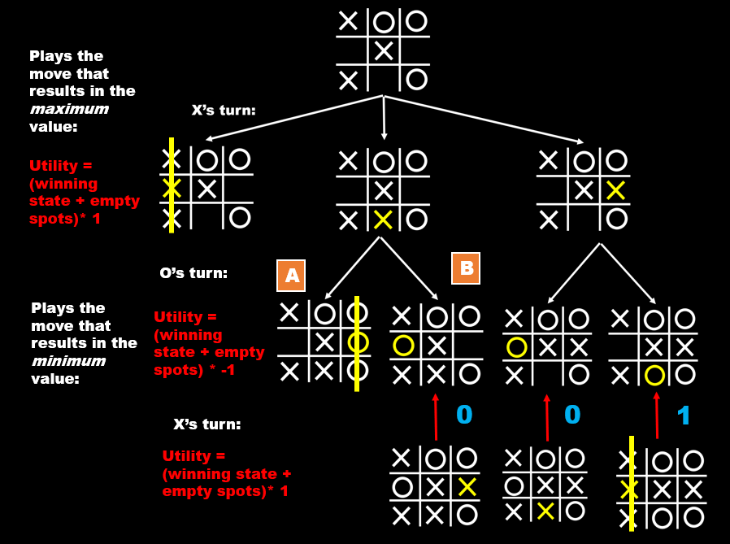
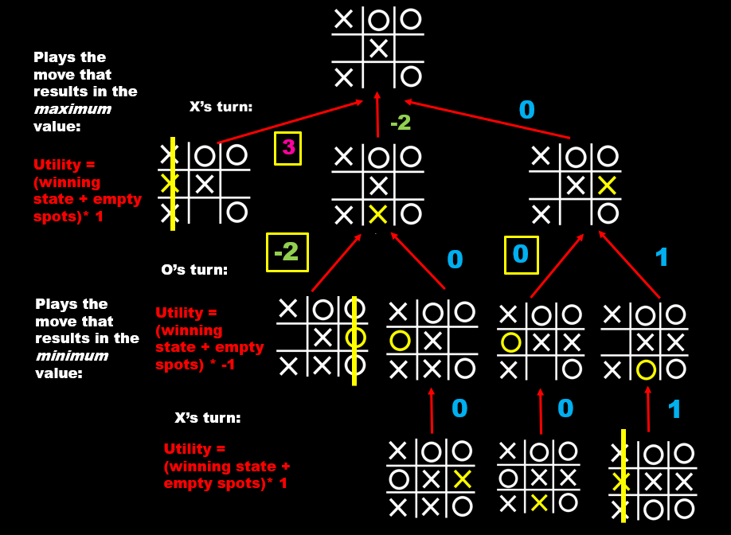
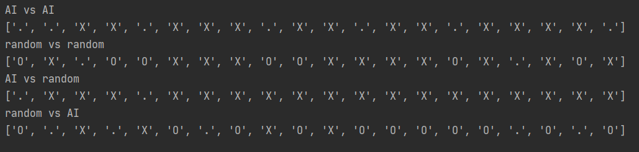
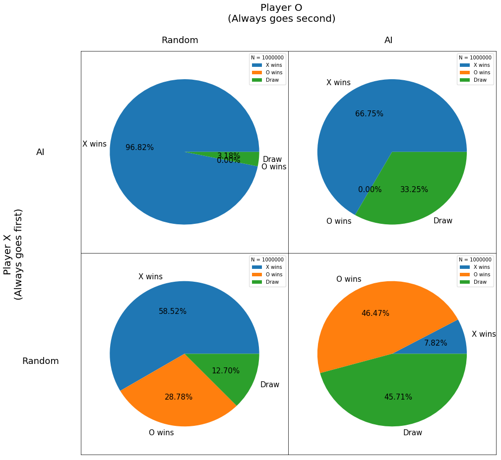

# tictactoeAI

This is an implementation of Minimax Algorithm on tic-tac-toe. Since tic-tac-toe is simple, we can explore optimization, classification, and reinforcement learning with the game and compare their efficiencies. This project focuses on Minimax Optimization, which means the AI is able to find the best move and play against human players. 

Note that all code in this project is written in **Python 3**. The older python versions may have problem running "//" in line 65 in tictactoe.py

## Minimax Explanation

  The Minimax Algorithm will maximize the score for X and minimize the score for O. This way the AI can choose the optimum move for each player.

  Our basic algorithm for the maximum player will be:
```
def maximizer(board, player):
  create an empty dictionary
  for every empty spots on the board:
    place player
    calculate the score of current board
    if there is a winner:
      append the score and its position to a dictionary
    else:
      call the minimizer and get the minimum
      append that minimum
 return the dictionary
```

  For example, in a X-to-move situation:

<p align = "center">
  
</p>

  First, the Minimax Algorithm will go and explore **every possible moves** on the board. Since tic-tac-toe is a simple game, we do not set a maximum depth for the algorithm. It will stop **when there is a winner or when the board is full**, calculate the value of that board using the utility function (see below), and record the value and its corresponding move in a dictionary.

  This algorithm runs recursively, so we will calculate the values from the bottom and return them up the chain, to the board we start with. Here is a visualization:

<p align = "center">
  
</p>

  When there is only one result situation, the value and the player's move will automatically pass up to the previous board. 

<p align = "center">
  
</p>

  However, when there are more than one board, depends on the player type (max or min), the get_min/get_max functions from the dictionary will *only* return the min/max value and send that up to the previous board. 

  For example, Situation A has a value of **-2**: 1 for the winner, 1 for the empty spot, and a scalar -1 for the minimum player (see utility function below). Situation B has a value of **0** which is passed up by the draw state at position 6. Since O player always chooses the move that minimizes the board values, it will pick the move that results in the smallest outcome possible; in this case, when choosing from a dictionary **{4: 0, 6: -2}**, O will pick position 6.

  In these images, the selected minium/maximum values are circled in yellow. 

<p align = "center">
  
</p>

<p align = "center">
  
</p>

  Finally, the values go back to the first board, and it will return the optimum move based on the values it gathered. In this example, X's best move is at 4. 

## Code Explanation

  ### Board
  
   

  ### Game Setup
  
   We will create a list of three lists, each containing three strings. From top to bottom, left to right, we number each position from 1 to 9. The positions should be as follow:
   
```
   1  2  3
   
   4  5  6
   
   7  8  9
```   
   There are also three chips: X, O, and EMPTY, which are all type string. When the game starts, a new empty board will be created:
   
```
   .  .  .
   
   .  .  .
   
   .  .  .
```

   The other functions are:
   * Positions
      * Convert the number position into indices
      * Return the player at a position
   * Empty or not
      * Check if the position is empty
      * Count the numbers of empty positions
      * Return all empty positions
   * Moves
      * A method for human players to type their moves
      * Place a chip at a certain position
      * Place a chip at a random position
   * Winners
      * Check if the board still has empty spots
      * Return the winner
      
   With these basic functions, we can build a tic-tac-toe game against a random computer.
      
  ### Dictionary
  
   The two methods will return the first of all max/min values from a dictionary.
   
  ### Maximizer
  
   The maximizer will maximize the returning value of the moves for the maximum player, usually X or human.
   
  ### Minimizer
  
   The minimizer will minimize the returning value of the moves for the minimun player, usually O or computer.
   
  ### Utility functions
  
   This function will calculate the values of each position for the current board. 
   
   We will assign a value for each state of winning: 
   
      wins = 1, draw = 0
      
   The utility function, which is combined in the code, will add the winner value to the numbers of empty positions. If the winner is the minimum player, we will multiply the utility value by -1. [1]
   
      utility = (winning state + empty spots) * (winning player)
      
   For example, in the board below, if X wins immediate, the utility equation should return (1 + 7) * 1 = 8
   
   
   
## Game.py

The first two moves are randomly generated to make the program run faster, or the algorithm will always play at position 1. For now, the file will return a list of winners for each type of game.



All the print functions are turned off, or the games should run like this:


There is also an interactive function called AI_human, where the player can play against the AI.


When choosing a player, type either "X" or "O", else the code will ask you to try again.


## Game Analysis

  To prove the efficacy of AI, we generated a 2-by-2 design of four csv files of game data, with player Xs on rows and player Os on columns. The table below shows how our files will be aligned:

<p align = "center">
  
</p>

  **Recall that we are generating standard tic-tac-toe games with first two moves randomized. This means that X will always go first, followed by O.**

  Following this design, each file contains multiple runs of results. For every run, we have counted the winners of 100 games and recorded the values as a dictionary:

```
  {"X wins": 99, "O wins": 0, "Draw": 1}
```

  After collecting multiple dictionaries, the data file looks like this:

```
  X wins,O wins,Draw
  97,0,3
  97,0,3
  96,0,4
  99,0,1
  96,0,4
  97,0,3
```

  We will continue to add results to the data files as we run data.py. Up till now, each file contains 10,000 runs and 1,000,000 games in total.

  Using those data and the table design above, we created four pie charts to show the percentage of each winner in different types of methods:

<p align = "center">
  
</p>

## Final Comments on AI Performance

  In a standard tic-tac-toe game, X will always go first and O will always play second. Since our min/max methods always choose the lowest position number with the min/max value (for example, X's first move will always be position 1 on an empty board, after it exhaustively goes through all possible games in tic-tac-toe), we randomize the first two moves to add more variability to games generated and to speed up the algorithm. We generated 1,000,000 games to get a great sampling.

  According to our graph, when AI plays as X and starts first, it never loses to O, the second player. Compared to random player, X-AI player has 40% more winning rate.

  On the bottom left of the pie charts, when X and O both play randomly, O only wins 28% of times. However, on the bottom right, where O is using the AI, O's losing rate (X's winning rate) successfully decreases from 59% to 7.8%. When two AI play against each other as on the top left, 30% more draws are generated than the pie chart on the left, when O is random. The O-AI player increases the difficulty for X-AI player to win.

  Our AI algorithm is proven to be effective, but there are still some space for improvement. As for now, the get_min/get_max method will only return the index of the first min value it encounters (for example, when both position 2 and position 6 has the lowest utility value 0, the get_min method will only return 2). We look forward to 
modifying this flaw so that when there are multiple mins/maxs, the algorithm is able to randomly pick one of them. To further improve its efficiency, we might also consider applying the [Alpha-beta pruning] [2] so that the AI does not need to explore every existing state.

  We will continue to apply machine learning on tic-tac-toe and explore its efficiency. Next step will be a classification model on tic-tac-toe that can classify steps through randomly-generated games and find the move with the highest percent of winning. 


## Footnotes

[1]: Coding an UNBEATABLE Tic Tac Toe AI (Game Theory Minimax Algorithm EXPLAINED) https://youtu.be/fT3YWCKvuQE

[2]: https://en.wikipedia.org/wiki/Alpha%E2%80%93beta_pruning "Alpha-beta pruning"
